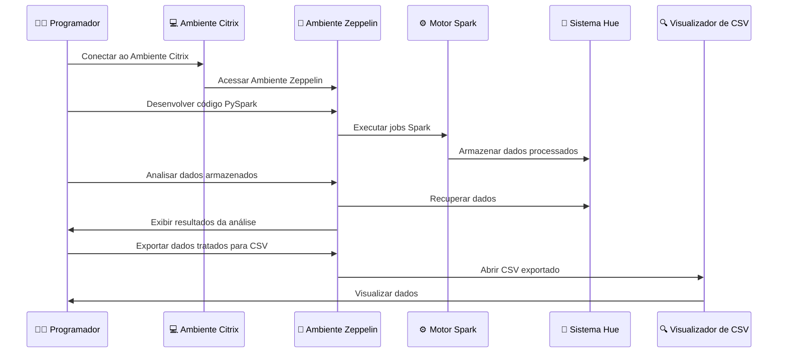

# Apresentação de Estágio na Squad de Ciência de Dados - Pernambucanas

## 1. Introdução
- **Nome:** Vincenzo Amendola
- **Posição:** Estagiário de Ciência de Dados
- **Equipe:** Squad de Ciência de Dados da Pernambucanas

## 2. Papel da Squad de Ciência de Dados
- Objetivo: O primordial na Squad é assegurar que os dados sejam entregues de forma filtrada e detalhada, englobando a análise minuciosa de arquivos CSV e bancos de dados SQL.
- Principais responsabilidades:
  - Análise de dados
  - Tratamento de dados
  - Criação de modelos preditivos

## 3. Fluxo de Trabalho
- **Engenheiro de Dados:**
  - Define a lógica dos processos
- **Estagiário de Ciência de Dados:**
  - Implementa a lógica usando PySpark no ambiente Zeppelin

## 4. Ambiente de Trabalho e Ferramentas
- **Ferramentas:**
  - **Citrix:** Para se conectar aos softwares da Pernambucanas (Impala, Hue) e 2RP (Zeppelin)
  - **Impala e Hue:** Para acessar e consultar os dados
  - **Zeppelin:** Para desenvolvimento e execução de código PySpark, conectado ao Impala e Hue
  - **Spark:** Instalado no ambiente Zeppelin para processamento de dados
- **Processo:**
  - Acesso aos bancos de dados via Citrix
  - Seleção dos DataFrames
  - Tratamento de dados e seleção de colunas importantes

## 5. Exemplo de Processo de Tratamento de Dados

### Passos da Demonstração ao Vivo:
1. **Obtenção dos dados:**
    - Acesso a um arquivo CSV de grande volume.
  
2. **Conexão ao ambiente Zeppelin via Citrix:**
    - Utilização do Citrix para acessar o Zeppelin.
  
3. **Desenvolvimento de código PySpark no Zeppelin:**
    - Escrever scripts PySpark para processamento de dados.
  
4. **Processamento dos dados utilizando Spark:**
    - Executar os scripts no Spark para transformar os dados.
  
5. **Análise dos dados processados no Zeppelin:**
    - Realizar a análise e tratamento dos dados dentro do Zeppelin.
  
6. **Exportação dos dados tratados para um novo arquivo CSV:**
    - Salvar os dados processados em um novo arquivo CSV.
  
7. **Visualização dos dados no visualizador de CSV:**
    - Abrir e inspecionar os dados no visualizador de CSV.

### Exemplos Adicionais:
- **Filtragem de dados:**
    - Remover linhas duplicadas ou irrelevantes.
    - Filtrar dados com base em condições específicas.
  
- **Agregação de dados:**
    - Calcular estatísticas como média, mediana, e desvio padrão.
    - Agrupar dados por categorias e calculClaro, aqui está a apresentação com mais exemplos e o diagrama transformado em um bloco de código Markdown:
ar somas ou contagens.
  
- **Enriquecimento de dados:**
    - Integrar dados de várias fontes.
    - Adicionar colunas com informações derivadas ou calculadas.

## 6. Desafios e Soluções
- **Desafios:**
  - Integração de diferentes fontes de dados
  - Tratamento de grandes volumes de dados
- **Soluções:**
  - Colaboração constante com o engenheiro de dados
  - Utilização eficiente das ferramentas disponíveis (Impala, Hue, Zeppelin)

## 7. Resultados e Impacto
- **Resultados Significativos:**
  - Otimização de processos de tratamento de dados
  - Insights valiosos para a tomada de decisões estratégicas
- **Impacto no Negócio:**
  - Melhoria na eficiência operacional
  - Suporte à inovação e crescimento

## 8. Conclusão e Próximos Passos
- **Resumo:**
  - Papel na equipe
  - Ferramentas e processos utilizados
  - Resultados alcançados
- **Próximos Passos:**
  - Aderir ao Bitbucket para versionamento de código
  - Implementar Airflow hospedado no GCP para orquestração de workflows
  - Continuar aprimorando as habilidades em PySpark
  - Participar de novos projetos desafiadores

## Diagrama de Fluxo de Trabalho com Mermaid

