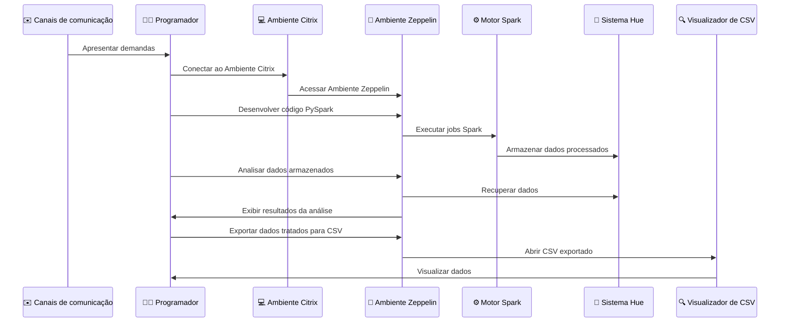
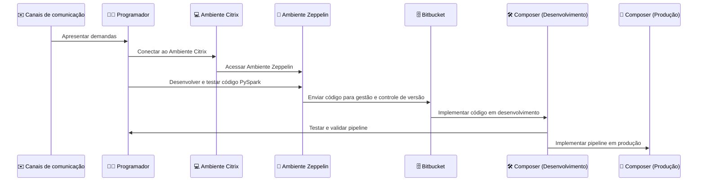

# Prevenção à fraude - Tribo Riscos&Banking

## Squad Prevenção à fraude
A squad Prevenção à Fraude é responsável por processar dados e gerar insights valiosos através de dashboards que ajudam na identificação de fraudes, entendimento aprofundado do que está ocorrendo e melhoria nas regras de prevenção. Atendemos aos gestores das empresas Palmeiras, Carmen Steffens e Leroy Merlin, e auxiliamos em processos da tribo de negócios.

## O que estamos fazendo?
Migração da solução de processamento de dados de Pentaho para AirFlow e Spark nos negócios White Label, CallCenter, entre outros. 

## Vantagens da migração
- Adequação às ferramentas utilizadas pela PEFISA.
- Redução no tempo de processamento de dados
- Redução no tempo para geração de insights e identificação de fraudes
- Automação de processos, com agendamento das pipelines de processamento no AirFlow

## Fluxo de Trabalho

### Atual



### Em implementação



## Ambiente de Trabalho e Ferramentas
- **Ferramentas:**
  - **Citrix:** Para se conectar aos softwares da Pernambucanas (Impala, Hue) e 2RP (Zeppelin)
  - **Impala e Hue:** Para acessar e consultar os dados
  - **Zeppelin:** Para desenvolvimento e execução de código PySpark, conectado ao Impala e Hue
  - **Spark:** Instalado no ambiente Zeppelin para processamento de dados
  - **Airflow**: Para orquestração de pipelines

## Exemplo de Processo de Tratamento de Dados

### Passos da Demonstração ao Vivo:
- **1 - Iniciar a SparkSession:**
    ```python
    from pyspark.sql import SparkSession
    spark = SparkSession.builder \
        .appName("Exemplo de Tratamento de Dados") \
        .getOrCreate()
    ```

-  **2 - Ler dados de uma tabela do Impala:**
    ```python
    df = spark.read.format("jdbc") \
        .option("url", "jdbc:impala://<impala_host>:<impala_port>/<database>") \
        .option("dbtable", "<tabela>") \
        .option("user", "<usuario>") \
        .option("password", "<senha>") \
        .load()
    ```

- **3 - Selecionar colunas importantes:**
    ```python
    df_selecionado = df.select("coluna1", "coluna2", "coluna3")
    ```

- **4 - Renomear colunas:**
    ```python
    df_renomeado = df_selecionado.withColumnRenamed("coluna1", "nova_coluna1")
    ```

- **5 - Converter tipos de dados:**
    ```python
    df_convertido = df_renomeado.withColumn("nova_coluna1", col("nova_coluna1").cast("Integer"))
    ```

- **6 - Mostrar o resultado final:**
    ```python
    df_convertido.show()
    ```


### Próximos Passos
  - Aderir ao Bitbucket para versionamento de código
  - Desenvolver pipeline de CI e CD
  - Implementar pipelines de processamento de dados no Airflow hospedado no GCP para orquestração de workflows
  - Migrar todos os fluxos de Pentarro para Airflow