# Apresentação de Estágio na Squad de Ciência de Dados - Pernambucanas

## 1. Introdução
- **Nome:** Thiago Tavares, Sergio Ricardo e Vincenzo
- **Equipe:** Squad Riscos e Banking (TRIBO)

## 2. Papel da Squad de Ciência de Dados
- Objetivo: O primordial na Squad é assegurar que os dados sejam entregues de forma filtrada e detalhada para o time de Negócios.
- Principais responsabilidades:
  - Análise de dados
  - Tratamento de dados
  - Criação de Dashboards no BI

## 3. Fluxo de Trabalho
- **Engenheiro de Dados:**
  - Define a lógica dos processos

## 4. Ambiente de Trabalho e Ferramentas
- **Ferramentas:**
  - **Citrix:** Para se conectar aos softwares da Pernambucanas (Impala, Hue) e 2RP (Zeppelin)
  - **Impala e Hue:** Para acessar e consultar os dados
  - **Zeppelin:** Para desenvolvimento e execução de código PySpark, conectado ao Impala e Hue
  - **Spark:** Instalado no ambiente Zeppelin para processamento de dados

## 5. Exemplo de Processo de Tratamento de Dados

### Passos da Demonstração ao Vivo:
1. **Desenvolvimento de código PySpark no Zeppelin:**
    - Escrever scripts PySpark para processamento de dados.
  
2. **Processamento dos dados utilizando Spark:**
    - Executar os scripts no Spark para transformar os dados.
  
3. **Análise dos dados processados no Zeppelin:**
    - Realizar a análise e tratamento dos dados dentro do Zeppelin.
  
4. **Exportação dos dados tratados para um novo arquivo CSV:**
    - Salvar os dados processados em um novo arquivo CSV.
  
5. **Visualização dos dados no visualizador de CSV:**
    - Abrir e inspecionar os dados no visualizador de CSV.

### Exemplos Adicionais:
- **Filtragem de dados:**
    - Remover linhas duplicadas ou irrelevantes.
    - Filtrar dados com base em condições específicas.
  
- **Agregação de dados:**
    - Calcular estatísticas como média, mediana, e desvio padrão.
  
- **Enriquecimento de dados:**
    - Integrar dados de várias fontes.
    - Adicionar colunas com informações derivadas ou calculadas.

## 6. Resultados e Impacto
- **Resultados Significativos:**
  - Otimização de processos de tratamento de dados
  - Insights valiosos para a tomada de decisões estratégicas
- **Impacto no Negócio:**
  - Melhoria na eficiência operacional
  - Suporte à inovação e crescimento

## 7. Conclusão e Próximos Passos
- **Resumo:**
  - Papel na equipe
  - Ferramentas e processos utilizados
  - Resultados alcançados
- **Próximos Passos:**
  - Aderir ao Bitbucket para versionamento de código
  - Implementar Airflow hospedado no GCP para orquestração de workflows

## Diagrama de Fluxo de Trabalho com Mermaid

```mermaid 

sequenceDiagram
    participant Programmer as 👨‍💻 Programador
    participant Citrix as 💻 Ambiente Citrix
    participant Zeppelin as 🎈 Ambiente Zeppelin
    participant Spark as ⚙️ Motor Spark
    participant Hue as 💾 Sistema Hue
    participant CSVViewer as 🔍 Visualizador de CSV

    Programmer->>Citrix: Conectar ao Ambiente Citrix
    Citrix->>Zeppelin: Acessar Ambiente Zeppelin
    Programmer->>Zeppelin: Desenvolver código PySpark
    Zeppelin->>Spark: Executar jobs Spark
    Spark->>Hue: Armazenar dados processados
    Programmer->>Zeppelin: Analisar dados armazenados
    Zeppelin->>Hue: Recuperar dados
    Zeppelin->>Programmer: Exibir resultados da análise
    Programmer->>Zeppelin: Exportar dados tratados para CSV
    Zeppelin->>CSVViewer: Abrir CSV exportado
    CSVViewer->>Programmer: Visualizar dados

```

